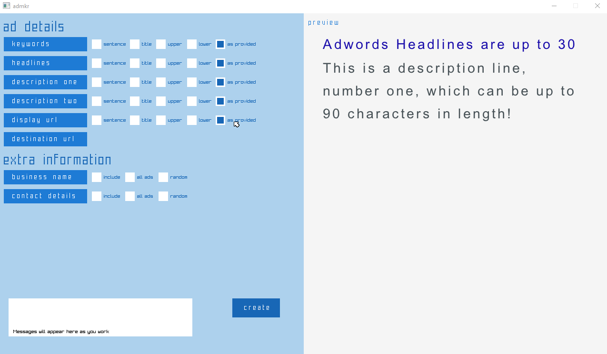

# bulk_adwords_ad_creator_Aug2021
A tool made in Go/Golang which turns CSV files into bulk ads for people working with many keywords

Having worked as an AdWords writer for a few years I had the idea of creating a tool that makes it easy for anyone writing ads for 1000's of keywords to create ads easily. Basically the tool takes CSVs and automatically creates ads based on the parameters you select.

This is unfinished project, however the basics do work and it will generate ads. The CSV files can be edited to allow you to add different phrases or words. Basically a proof of concept which I hope to complete sometime in future.

  

  
